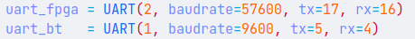
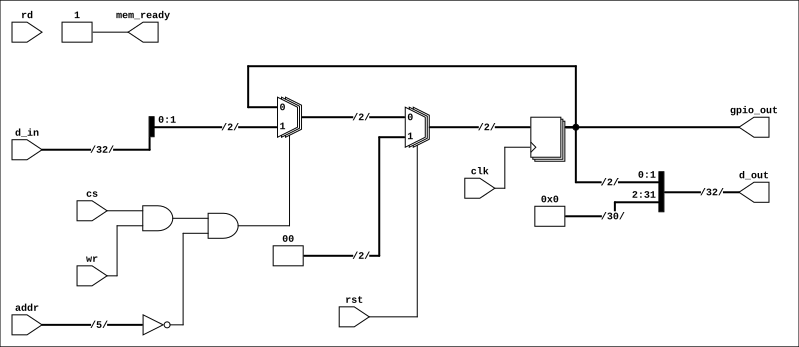
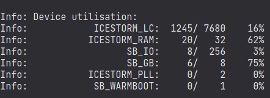
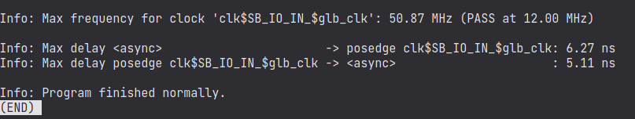

<!-- LTeX: enabled=true language=es -->
<!-- :set spell! -->
<!-- :MarkdownPreview -->
<!-- :GenTocMarked -->

# Sensor de conductividad eléctrica "TDS"

Se busca poder medir el parámetro de conductividad eléctrica del suelo
de una siembra de café en estado de invernadero, esto con el fin de
cuantificar y parametrizar las cantidades de fertilizantes que deben
suministrarse vía riego.

La sustentación de la elección de estos parámetros y la justificación de
la razón por la que son importantes se pueden encontrar resaltadas en el
documento "Estudio.pdf" encontrado en la raíz de este módulo.

## Arquitectura de comunicaciones:

En la FPGA se definen los pines 135 y 134 como TDX y RDX del protocolo
UART respectivamente, los cables conectados a estos pines se conectan a
su vez a los pines 17 y 16 del ESP32, siendo estos el tx y el rx
respectivamente.

Adicionalmente se definen otros puertos que serán los que se usaran para
enviar datos al módulo bluetooth hc-06, que son el pin 5 y 4.

Los pines 136, 139, 138 y 142 de la FPGA son los asociados a los leds, y
estos son los que se encargan de encenderlos o apagarlos según los
valores y la lógica establecida.

El pin 36 del ESP32 será el usado para captar el valor analógico
proveniente del sensor, a este se conecta el cable correspondiente en el
sensor.

Para este módulo, todas las alimentaciones se conectan al 3.3v tanto del
ESP32 como de la FPGA, y todas las tierras van al mismo punto.

## Elementos

Para empezar se requieren los siguientes elementos físicos:

1. FPGA ice40-hx4k-MyStorm-BlackIce-Mx 
2. ESP32
3. Módulo bluetooth HC-06
4. Un sensor de conductividad eléctrica analógico 
5. 4 resistencias de 1 kOhm
6. 4 leds de colores representativos 
7. Jumpers en general

## Requerimientos funcionales

1. Medir la conductividad eléctrica del suelo regado en ppm (partes por millón).
2. Cuando el parámetro este por encima o por debajo de los valores críticos se debe encender el led rojo.
3. Cuando el parámetro medido sea menor a 512ppm, se debe encender el led amarilo.
4. Cuando el parámetro medido sea mayor a 704ppm, se debe encender el led azul.
5. Cuando el parámetro medido este entre los valores críticos, se debe encender el led verde.
6. El parámetro medido debe ser enviado vía bluetooth y debe poder ser visto en una terminal.
7. El parámetro medido debe ser enviado vía MQTT.

## Diagrama ASM

## Diagramas RTL
### Diagrama RTL del SoC

### Diagrama RTL del módulo peripheral_gpio.v

## Simulación
**1. Período de Inicialización (0 ns - 40 ns):**
* La señal de reset (rst) se mantiene en estado alto.
- Bajo la condición de reset, la salida "gpio_out" es forzada a "00" en el primer flanco de reloj, confirmando el correcto funcionamiento de la lógica de reinicio.

**2. Primera Operación de Escritura (50 ns - 70 ns):**
- En el instante 50 ns, se inicia un ciclo de escritura activando "cs" y "wr".
- La dirección (addr) es "0x00" y el dato de entrada (d_in) es "0x00000001".
- En el flanco de subida del reloj en 60 ns, el módulo captura los dos bits menos significativos de "d_in".
- **Resultado:** La salida "gpio_out" cambia exitosamente de "00" a "01".

**3. Segunda Operación de Escritura (90 ns - 110 ns):**
- En 90 ns, se inicia un nuevo ciclo de escritura en la dirección `0x00` con el dato de entrada "0x00000002".
- **Resultado:** En el flanco de reloj de 100 ns, la salida "gpio_out" se actualiza correctamente de "01" a "10".

**4. Intento de Escritura Inválida (130 ns - 150 ns):**
- En 130 ns, se intenta una escritura a una dirección no asignada al módulo ("addr" = "0x1F").
- El módulo detecta que la dirección no coincide con la suya.
- **Resultado:** La salida "gpio_out" no sufre ninguna modificación y mantiene su valor de "10", demostrando que la lógica de decodificación de direcciones funciona correctamente.

## Warnings y recursos usados (logs de make log-pnr y log-syn)
### Make log-pnr:

[./build/nextpnr-SOC.log](./build/nextpnr-SOC.log)

#### Datos importantes:
**Utilización de recursos:**

**Frecuencia máxima del reloj y numero de Warnings:**

**Información del Warning:**
Como se puede ver no existen Warnings.

### Make log-syn:

[./build/yosys-SOC.log](./build/yosys-SOC.log)

#### Datos importantes:
**1. Advertencias (Warnings)**

Se encontraron un total de 96 advertencias durante la fase de comprobación del diseño (CHECK pass). Todas las advertencias son del mismo tipo.

**Tipo de Advertencia:**  "Wire [...] is used but has no driver."
(El cable [...] se usa pero no tiene un conductor/fuente de señal).

Estas advertencias indican que las salidas de varios periféricos que no están implementados en el diseño (como dpram_dout, div_dout, bin2bcd_dout) están conectadas a un multiplexor, pero nunca se les asigna un valor. 

**2. Recursos lógicos sintetizados**

* **Look-Up Tables (LUTs):**
	* SB_LUT4: 1125

* **Flip-Flops (Registros):**
    * SB_DFF: 34
    * SB_DFFE: 135
    * SB_DFFER: 33
    * SB_DFFESR: 111
    * SB_DFFESS: 1
    * SB_DFFR: 3
    * SB_DFFSR: 18
    * SB_DFFSS: 4
    
    * **Total Flip-Flops: 339**

* **Celdas de Acarreo (Carry Cells):**
    * SB_CARRY: 210

* **Bloques de Memoria (RAM):**
    * SB_RAM40_4K: 20

El diseño se ha sintetizado principalmente en 1125 LUTs para la lógica combinacional, 339 Flip-Flops para la lógica secuencial y ha hecho uso de 20 bloques de RAM para la memoria y el banco de registros.

## Interacción con aplicaciones externas, implementación y funcionamiento:

https://www.youtube.com/watch?v=UTRQ8nriFKM

Finalmente, en la carpeta "Versiones", se encuentran todas las pruebas y versiones del módulo, al ejecutar cada una de estas se puede evidenciar la evolución del proceso de desarrollo. Para ejecutar cada una de estas versiones se deben seguir los pasos del vídeo.
